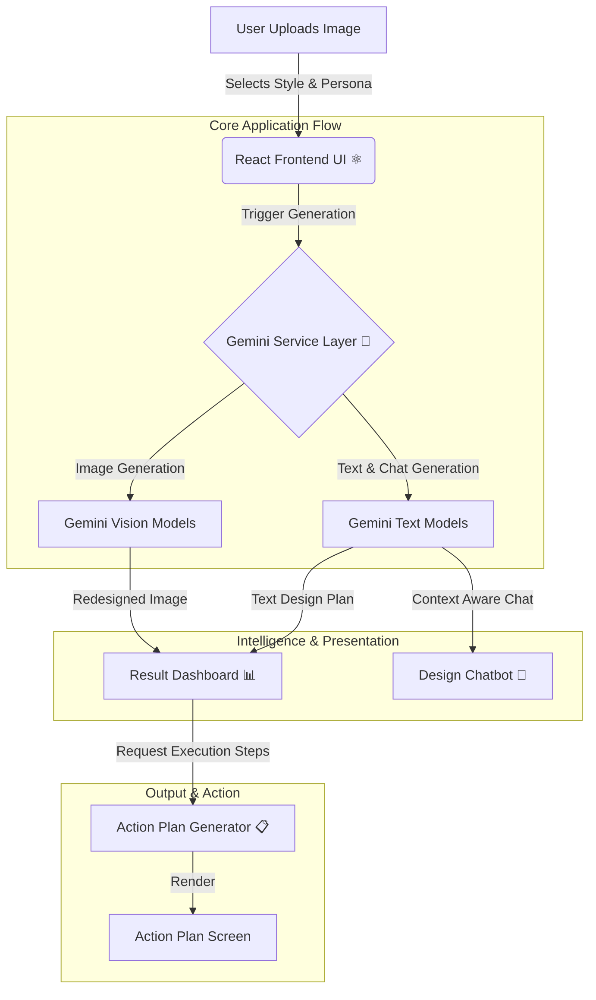

<div align="center">

# 🏡 AI Interior Designer
### Intelligent Room Transformation & Design Analysis Tool

[](https://react.dev/)
[](https://www.typescriptlang.org/)
[](https://vitejs.dev/)
[](https://tailwindcss.com/)
[](https://ai.google.dev/)

*Empowering your space with AI-generated designs, expert consultations, and actionable renovation plans.*

[Features](#features) • [Architecture](#architecture) • [Installation](#installation) • [Configuration](#configuration) • [Usage](#usage)

</div>

---

## 🚀 Overview

**AI Interior Designer** is a sophisticated, AI-driven React web application that completely transforms how you plan home renovations. Simply upload an image of your room, choose a preferred design style and designer "persona", and watch as the system generates a meticulously crafted redesign.

Leveraging the **Google Gemini API**, it provides far more than just images; it delivers a **Full Design Plan**, suggests alternative styles, allows targeted editing of room elements, and even features a **Context-Aware Chatbot** so you can consult with the AI designer about materials, layout, and implementation strategies.

## <a name="features"></a>✨ Features

| Feature | Description |
|:---:|:---|
| **🖼️ AI Image Redesign** | Automatically generates high-quality, photorealistic redesigned room images based on your selected aesthetic style. |
| **🧠 Smart Design Plans** | Generates comprehensive text-based design strategies and material recommendations tailored to specific interior design personas. |
| **💬 Interactive Chatbot** | Consult with an AI interior designer directly about the generated plan, ask for clarification, and request specific modifications. |
| **🎨 Style Explorer** | Dynamically suggests alternative complementary styles and extracts editable elements directly from your room. |
| **📋 Actionable Checklists** | Creates step-by-step, actionable implementation guides (Action Plans) to help bring your AI-generated design to reality. |
| **⚡ Real-time Feedback** | Fast, responsive UI built with React 19 and Framer Motion for a premium user experience across all devices. |

## <a name="architecture"></a>🛠️ Architecture

The system operates on a modern React frontend architecture, deeply integrated with the Gemini AI service layer for image and language generation.



## 📂 Project Structure

```bash
📦 AI-Interior-Designer-
├── 📂 src                    # 🧠 Core Application Logic
│   ├── 📂 components         # React UI Components (Upload, Results, Chatbot, etc.)
│   ├── 📂 services           # AI Integration Layer (geminiService.ts)
│   ├── App.tsx               # Main Application Component & State routing
│   ├── main.tsx              # React Entry Point
│   ├── types.ts              # TypeScript Interfaces & Types
│   └── index.css             # Tailwind & Global Styles definition
├── .env.local                # ⚙️ Environment Variables (API Keys)
├── package.json              # 📦 Dependencies & Scripts
├── tsconfig.json             # TypeScript Configuration
└── vite.config.ts            # ⚡ Vite bundler configuration
```

## <a name="installation"></a>⚡ Installation

### Prerequisites
- **Node.js 20+** (Required for optimal Vite 6 compatibility)
- **npm**, **yarn**, or **pnpm**
- A **Google Gemini API Key** (Accessible via [Google AI Studio](https://aistudio.google.com/))

### 1. Clone the Repository
```bash
git clone https://github.com/Anas-Rehman/AI-Interior-Designer-.git
cd AI-Interior-Designer-
```

### 2. Install Dependencies
```bash
npm install
# or
yarn install
# or
pnpm install
```

## <a name="configuration"></a>⚙️ Configuration

1. Create a `.env.local` file in the root directory:
```bash
# Mac/Linux
touch .env.local

# Windows
type NUL > .env.local
```

2. Add your Google Gemini API key to the environment file. 
**Critical Note:** The `VITE_` prefix is strictly required. The Vite bundler aggressively sanitizes environment variables for security purposes; without the `VITE_` prefix, the API key will be stripped from the static client-side build and the application will fail to authenticate with the Google GenAI SDK.

```ini
# .env.local
VITE_GEMINI_API_KEY=AIzaSy...
```

## <a name="usage"></a>🕹️ Usage

### 🚀 Starting the Development Server
To run the application locally on your machine with hot-reloading:

```bash
npm run dev
```
*This will start the Vite development server, usually accessible at http://localhost:3000.*

### 📦 Building for Production
To create an optimized production build:

```bash
npm run build
```

### 🧹 Linting & Cleaning
To check TypeScript errors without emitting files:
```bash
npm run lint
```

To clean the build directory:
```bash
npm run clean
```

### 🌍 Deployment & CI/CD
This project is configured with a robust CI/CD pipeline using **GitHub Actions**. Upon pushing to the `main` branch, the workflow automatically installs dependencies, builds the Vite production static assets, and deploys them to **GitHub Pages**.

**Prerequisites for automated deployment:**
1. Ensure GitHub Pages is enabled in your repository settings (Settings > Pages > Source: GitHub Actions).
2. Ensure you have added your actual API key as a Repository Secret named `GEMINI_API_KEY` (Settings > Secrets and variables > Actions). The workflow automatically maps this secret to the `VITE_` prefix required by the build process.

<div align="center">

Made with ❤️ and ☕ by **Muhammad Anas Rehman**

Created with the help of **Google Antigravity**

</div>
